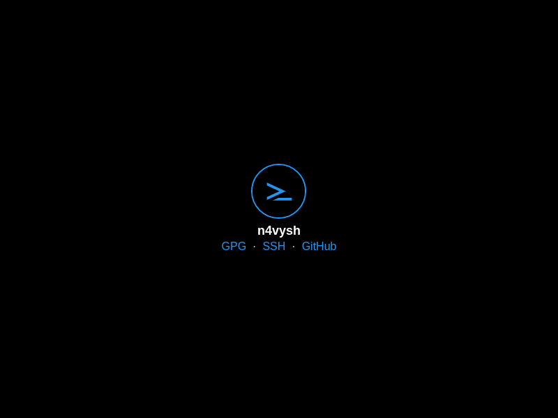
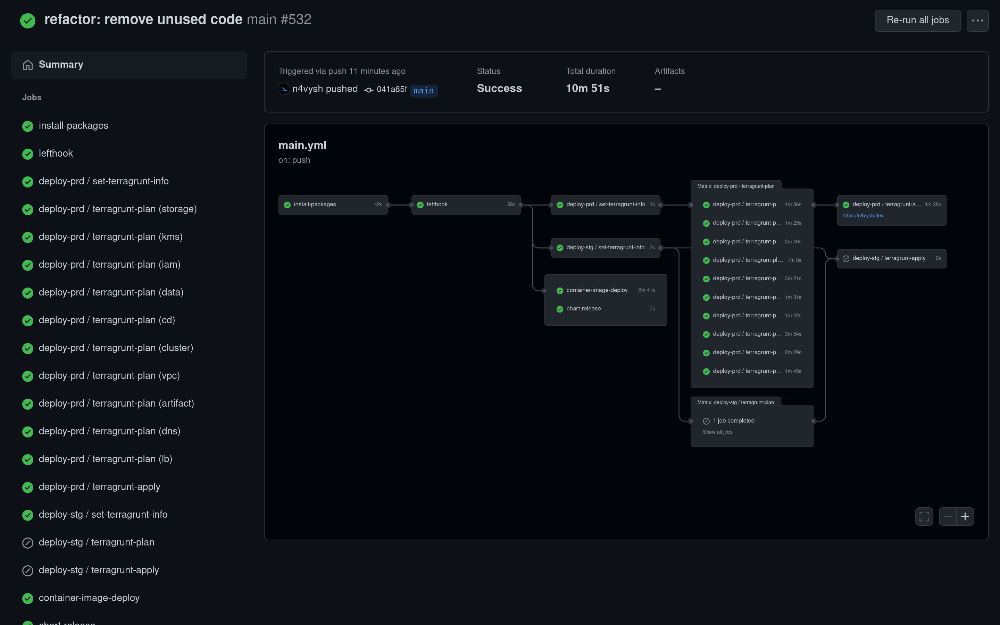

# Portfolio

[](https://n4vysh.dev)

This repository contains the source code of the website to show technical
skillsets and expertise.

## Features

- Cloud Native
- Infrastructure as Code
- CIOps
- GitOps
- Progressive Delivery

## Requirements

Need Unix-like operating system and following tools.

| Name                                  | Description                   | Version     |
| :------------------------------------ | :---------------------------- | :---------- |
| [Bash][bash-link]                     | Unix shell                    | ~> 5.1.16   |
| [Grep][grep-link]                     | Line-oriented search tool     | >= 3.7      |
| [sed][sed-link]                       | Stream editor                 | >= 4.8      |
| [Gawk][gawk-link]                     | Pattern scanning tool         | ~> 5.1.1    |
| [Findutils][findutils-link]           | Directory searching utilities | ~> 4.9.0    |
| [GNU parallel][gnu-parallel-link]     | Parallel job executor         | >= 20220322 |
| [asdf][asdf-link]                     | Version manager               | ~> 0.9.0    |
| [asdf-direnv][asdf-direnv-link]       | direnv plugin for asdf        | ~> 2.28.0   |
| [Docker][docker-link]                 | Virtualization software       | ~> 20.10.14 |
| [atool][atool-link]                   | File archive manager          | ~> 0.39.0   |
| [CCZE][ccze-link]                     | Log colorizer                 | ~> 0.2.1    |
| [GoAccess][goaccess-link]             | Log Analyzer                  | ~> 1.5.5    |
| [drawio-desktop][drawio-desktop-link] | Graph drawing software        | ~> 17.2.4   |

[bash-link]: https://www.gnu.org/software/bash/
[grep-link]: https://www.gnu.org/software/grep/
[sed-link]: https://www.gnu.org/software/sed/
[gawk-link]: https://www.gnu.org/software/gawk/
[findutils-link]: https://www.gnu.org/software/findutils/
[gnu-parallel-link]: https://www.gnu.org/software/parallel/
[asdf-link]: https://asdf-vm.com/
[asdf-direnv-link]: https://github.com/asdf-community/asdf-direnv/blob/4900445811e634702b3bb069cd9b8a4b717ea925/README.md#setup
[docker-link]: https://www.docker.com/
[atool-link]: https://www.nongnu.org/atool/
[ccze-link]: http://freshmeat.net/projects/ccze/
[goaccess-link]: https://goaccess.io/
[drawio-desktop-link]: https://www.diagrams.net/

## Development setup

Preview and edit the website on local machine as follows:

1. [Clone this repository on local machine][gh-clone-link]
2. Go to the project root directory of this repository in terminal
3. Run [`./scripts/install-packages.bash`][script-link] to install packages via
   asdf
4. Run `just` to start the server of [Aleph.js][alephjs-link] in `development`
   mode
5. Open <http://localhost:8080/> in browser
6. After done with the preview, press Ctrl-C in terminal to stop the server

While the preview is running, edit tsx and css files and automatically rebuild
them.

[gh-clone-link]: https://docs.github.com/en/get-started/getting-started-with-git/about-remote-repositories
[script-link]: ./scripts/install-packages.bash
[alephjs-link]: https://alephjs.org/

## Test

Run `just check` to lint and format the source code with
[pre-commit][pre-commit-link]. pre-commit run following tools.

| Name                                                                                                                                                                                                                                      | Target type                     |
| :---------------------------------------------------------------------------------------------------------------------------------------------------------------------------------------------------------------------------------------- | :------------------------------ |
| [deno fmt][deno-fmt-link] + [deno lint][deno-lint-link]                                                                                                                                                                                   | js, ts, tsx, md, and json files |
| [stylelint][stylelint-link] + [prettier][prettier-link]                                                                                                                                                                                   | CSS files                       |
| [lighthouse-ci][lighthouse-ci-link]                                                                                                                                                                                                       | frontend performance            |
| [skaffold][skaffold-link]                                                                                                                                                                                                                 | container image                 |
| [yamllint][yamllint-link]                                                                                                                                                                                                                 | YAML files                      |
| [taplo][taplo-link]                                                                                                                                                                                                                       | TOML files                      |
| [just][just-link]                                                                                                                                                                                                                         | justfile                        |
| [markdownlint][markdownlint-link] + [markdown-link-check][markdown-link-check-link]                                                                                                                                                       | Markdown files                  |
| [vale][vale-link]                                                                                                                                                                                                                         | prose                           |
| [shfmt][shfmt-link] + [shellharden][shellharden-link] + [shellcheck][shellcheck-link]                                                                                                                                                     | shell scripts                   |
| [commitlint][commitlint-link]                                                                                                                                                                                                             | commit messages                 |
| [gitleaks][gitleaks-link]                                                                                                                                                                                                                 | secrets                         |
| [codespell][codespell-link]                                                                                                                                                                                                               | misspellings                    |
| [actionlint][actionlint-link]                                                                                                                                                                                                             | GitHub Actions workflow files   |
| [kube-linter][kube-linter-link] + [ct][ct-link] + [kubeval][kubeval-link] + [datree][datree-link] + [kube-score][kube-score-link] + [polaris][polaris-link] + [pluto][pluto-link] + [helm-docs][helm-docs-link] + [checkov][checkov-link] | Helm charts                     |
| [terraform fmt][terraform-fmt-link] + [terraform validate][terraform-validate-link] + [terrascan][terrascan-link] + [trivy][trivy-link] + [tflint][tflint-link] + [terraform-docs][terraform-docs-link] + [checkov][checkov-link]         | tf files                        |
| [terragrunt hclfmt][terragrunt-hclfmt-link]                                                                                                                                                                                               | terragrunt.hcl                  |

[pre-commit-link]: https://pre-commit.com/
[deno-link]: https://deno.land/
[deno-fmt-link]: https://deno.land/manual/tools/formatter
[deno-lint-link]: https://deno.land/manual/tools/linter
[stylelint-link]: https://stylelint.io/
[prettier-link]: https://prettier.io/
[lighthouse-ci-link]: https://github.com/GoogleChrome/lighthouse-ci
[lighthouse-link]: https://github.com/GoogleChrome/lighthouse
[yamllint-link]: https://github.com/adrienverge/yamllint
[taplo-link]: https://taplo.tamasfe.dev/
[just-link]: https://github.com/casey/just
[markdownlint-link]: https://github.com/DavidAnson/markdownlint
[markdown-link-check-link]: https://github.com/tcort/markdown-link-check
[vale-link]: https://github.com/errata-ai/vale
[shfmt-link]: https://github.com/mvdan/sh
[shellharden-link]: https://github.com/anordal/shellharden
[shellcheck-link]: https://www.shellcheck.net/
[commitlint-link]: https://commitlint.js.org/#/
[gitleaks-link]: https://github.com/zricethezav/gitleaks
[codespell-link]: https://github.com/codespell-project/codespell
[actionlint-link]: https://github.com/rhysd/actionlint
[kube-linter-link]: https://github.com/stackrox/kube-linter
[helm-docs-link]: https://github.com/norwoodj/helm-docs
[ct-link]: https://github.com/helm/chart-testing
[kubeval-link]: https://www.kubeval.com/
[checkov-link]: https://www.checkov.io/
[datree-link]: https://www.datree.io/
[kube-score-link]: https://github.com/zegl/kube-score
[polaris-link]: https://www.fairwinds.com/polaris
[pluto-link]: https://github.com/FairwindsOps/Pluto
[terraform-fmt-link]: https://www.terraform.io/cli/commands/fmt
[terraform-validate-link]: https://www.terraform.io/cli/commands/validate
[terrascan-link]: https://runterrascan.io/
[trivy-link]: https://aquasecurity.github.io/trivy/
[tflint-link]: https://github.com/terraform-linters/tflint
[terraform-docs-link]: https://github.com/terraform-docs/terraform-docs
[terragrunt-hclfmt-link]: https://terragrunt.gruntwork.io/docs/reference/cli-options/#hclfmt

## Containerize

Run `just build` to build docker image of [nginx][nginx-link] with skaffold and
[Cloud Native Buildpacks][cnb-link]

[nginx-link]: https://nginx.org/en/
[cnb-link]: https://buildpacks.io/

## Update

Run `just update` to update dependency packages and pre-commit hooks.
Additionally [Renovate][renovate-link] create update pull requests every 3
months on the first day of the month.

[renovate-link]: https://renovatebot.com

## List

Run `just list` to list available commands in command runner.

## Deploy

Run following commands to deploy [Kubernetes][kubernetes-link] cluster and
resources.

```bash
ENV=dev just deploy # development environment
ENV=stg just deploy # staging environment
ENV=prd just deploy # production environment
```

The development environment create local Kubernetes cluster with
[kind][kind-link] and skaffold. Other environments create Kubernetes cluster in
[Amazon Web Services][aws-link] with [Terragrunt][terragrunt-link] and
[Flux][flux-link]. Terragrunt use following terraform modules.

| Tier      | Name                                                                                                       |
| :-------- | :--------------------------------------------------------------------------------------------------------- |
| Verified  | [terraform-aws-modules/eks/aws][terraform-module-eks-link]                                                 |
| Verified  | [terraform-aws-modules/iam/aws//modules/iam-assumable-role-with-oidc][terraform-module-iam-oidc-link]      |
| Verified  | [terraform-aws-modules/iam/aws//modules/iam-policy][terraform-module-iam-policy-link]                      |
| Verified  | [terraform-aws-modules/iam/aws//modules/iam-role-for-service-accounts-eks][terraform-module-iam-irsa-link] |
| Verified  | [terraform-aws-modules/route53/aws//modules/delegation-sets][terraform-module-route53-ds-link]             |
| Verified  | [terraform-aws-modules/route53/aws//modules/records][terraform-module-route53-records-link]                |
| Verified  | [terraform-aws-modules/route53/aws//modules/zones][terraform-module-route53-zones-link]                    |
| Verified  | [terraform-aws-modules/s3-bucket/aws][terraform-module-s3-bucket-link]                                     |
| Verified  | [terraform-aws-modules/vpc/aws][terraform-module-vpc-link]                                                 |
| Self‐made | [aws-iam-idp](./infra/terraform/modules/aws-iam-idp/README.md)                                             |
| Self‐made | [aws-kms-keys](./infra/terraform/modules/aws-kms-keys/README.md)                                           |
| Self‐made | [aws-load-balancer](./infra/terraform/modules/aws-load-balancer/README.md)                                 |
| Self‐made | [aws-route53-dnssec](./infra/terraform/modules/aws-route53-dnssec/README.md)                               |
| Self‐made | [flux](./infra/terraform/modules/flux/README.md)                                                           |
| Self‐made | [kubectl-manifests](./infra/terraform/modules/kubectl-manifests/README.md)                                 |

Self-made modules follow
[Terraform Best Practices](https://www.terraform-best-practices.com/).
Terragrunt show cost estimate with [infracost][infracost-link] and check budget
with [conftest][conftest-link] after the call to [Terraform][terraform-link].
Terragrunt and Flux deploy following middlewares using [Helm][helm-link] and
[Kustomize][kustomize-link] in production environment.

| Name                                                              | Description                                                                                                                                   |
| :---------------------------------------------------------------- | :-------------------------------------------------------------------------------------------------------------------------------------------- |
| [AWS Load Balancer Controller][aws-load-balancer-controller-link] | A Kubernetes controller for Elastic Load Balancers                                                                                            |
| [kube-prometheus-stack][kube-prometheus-stack-link]               | Operate end-to-end Kubernetes cluster monitoring with [Prometheus][prometheus-link] using the [Prometheus Operator][prometheus-operator-link] |
| [Thanos][thanos-link]                                             | Open source, highly available Prometheus setup with long term storage capabilities                                                            |
| [Fluent Bit][fluent-bit-link]                                     | Fast and Lightweight Logs and Metrics processor                                                                                               |
| [Loki][loki-link]                                                 | A horizontally scalable, highly available, multi-tenant log aggregation system inspired by Prometheus                                         |
| [Contour][contour-link]                                           | High performance ingress controller for Kubernetes using [Envoy Proxy][envoy-proxy-link]                                                      |
| [Linkerd][linkerd-link]                                           | Ultralight, security-first service mesh for Kubernetes                                                                                        |
| [Flagger][flagger-link]                                           | Progressive Delivery Operator for Kubernetes                                                                                                  |
| [Falco][falco-link]                                               | Cloud-Native runtime security                                                                                                                 |
| [metrics-server][metrics-server-link]                             | Scalable and efficient source of container resource metrics for Kubernetes built-in autoscaling pipelines                                     |

Flux deploy with following Helm charts and kustomization files.

| Type               | Tier      | Name                                                                    |
| :----------------- | :-------- | :---------------------------------------------------------------------- |
| Helm chart         | Official  | [aws-load-balancer-controller][helm-aws-load-balancer-controller-link]  |
| Helm chart         | Official  | [fluent-bit][helm-fluent-bit-link]                                      |
| Helm chart         | Official  | [loki][helm-loki-link]                                                  |
| Helm chart         | Official  | [contour][helm-contour-link]                                            |
| Helm chart         | Official  | [falco][helm-falco-link]                                                |
| Helm chart         | Official  | [falco-exporter][helm-falco-exporter-link]                              |
| Helm chart         | Official  | [linkerd2][helm-linkerd2-link]                                          |
| Helm chart         | Official  | [linkerd-viz][helm-linkerd-viz-link]                                    |
| Helm chart         | Official  | [metrics-server][helm-metrics-server-link]                              |
| Helm chart         | Community | [kube-prometheus-stack][helm-kube-prometheus-stack-link]                |
| Helm chart         | Community | [thanos][helm-thanos-link]                                              |
| Helm chart         | Self-made | [portfolio](./infra/charts/portfolio/README.md)                         |
| Helm chart         | Self-made | [target-group-bindings](./infra/charts/target-group-bindings/README.md) |
| kustomization file | Official  | [Flagger][kustomize-flagger-link]                                       |
| kustomization file | Official  | [Flagger loadtester][kustomize-flagger-loadtester-link]                 |

[helm-aws-load-balancer-controller-link]: https://artifacthub.io/packages/helm/aws/aws-load-balancer-controller
[helm-fluent-bit-link]: https://artifacthub.io/packages/helm/fluent/fluent-bit
[helm-loki-link]: https://artifacthub.io/packages/helm/grafana/loki
[helm-contour-link]: https://artifacthub.io/packages/helm/bitnami/contour
[helm-falco-link]: https://artifacthub.io/packages/helm/falcosecurity/falco
[helm-falco-exporter-link]: https://artifacthub.io/packages/helm/falcosecurity/falco-exporter
[helm-linkerd2-link]: https://artifacthub.io/packages/helm/linkerd2/linkerd2
[helm-linkerd-viz-link]: https://artifacthub.io/packages/helm/linkerd2/linkerd-viz
[helm-metrics-server-link]: https://artifacthub.io/packages/helm/metrics-server/metrics-server
[helm-kube-prometheus-stack-link]: https://artifacthub.io/packages/helm/prometheus-community/kube-prometheus-stack
[helm-thanos-link]: https://artifacthub.io/packages/helm/bitnami/thanos
[kustomize-flagger-link]: https://github.com/fluxcd/flagger/blob/v1.19.0/kustomize/linkerd/kustomization.yaml
[kustomize-flagger-loadtester-link]: https://github.com/fluxcd/flagger/blob/v1.19.0/kustomize/tester/kustomization.yaml

Run following commands to change kubernetes context with [Kubie][kubie-link] and
debug kubernetes resources.

```bash
cd infra/

ENV=dev just switch # development environment
ENV=stg just switch # staging environment
ENV=prd just switch # production environment

# Check status of pods, nodes, flux, and linkerd
just check

# Trigger a reconciliation of kubernetes sources and resources with flux
just reconcile

# Show nginx highlighted access logs with ccze
just log

# Analyze nginx access logs with GoAccess
just analyze

# Open Grafana of kube-prometheus-stack
just viz-monitor

# Open Linkerd viz extension
just viz-nw

# Login AWS with aws-vault
just login
```

kube-prometheus-stack can check monitoring status with [Grafana][grafana-link]
dashboard.

| Dashboard list                         | Example dashboard 1                              | Example dashboard 2                              |
| :------------------------------------- | :----------------------------------------------- | :----------------------------------------------- |
| ![Dashboard list][dashboard-list-link] | ![Example dashboard 1][example-dashboard-1-link] | ![Example dashboard 2][example-dashboard-2-link] |

linkerd can check traffic status with viz extension.

| Namespace list                         | Deployment information                                 | Grafana dashboard                            |
| :------------------------------------- | :----------------------------------------------------- | :------------------------------------------- |
| ![Namespace list][namespace-list-link] | ![Deployment information][deployment-infromation-link] | ![Grafana dashboard][grafana-dashboard-link] |

[kubernetes-link]: https://kubernetes.io/
[kind-link]: https://kind.sigs.k8s.io
[skaffold-link]: https://skaffold.dev/
[aws-link]: https://aws.amazon.com
[terragrunt-link]: https://terragrunt.gruntwork.io/
[infracost-link]: https://www.infracost.io/
[conftest-link]: https://www.conftest.dev/
[terraform-link]: https://www.terraform.io/
[flux-link]: https://fluxcd.io/
[terraform-module-eks-link]: https://registry.terraform.io/modules/terraform-aws-modules/eks/aws/latest
[terraform-module-iam-oidc-link]: https://registry.terraform.io/modules/terraform-aws-modules/iam/aws/latest/submodules/iam-assumable-role-with-oidc
[terraform-module-iam-policy-link]: https://registry.terraform.io/modules/terraform-aws-modules/iam/aws/latest/submodules/iam-policy
[terraform-module-iam-irsa-link]: https://registry.terraform.io/modules/terraform-aws-modules/iam/aws/latest/submodules/iam-role-for-service-accounts-eks
[terraform-module-route53-ds-link]: https://registry.terraform.io/modules/terraform-aws-modules/route53/aws/latest/submodules/delegation-sets
[terraform-module-route53-records-link]: https://registry.terraform.io/modules/terraform-aws-modules/route53/aws/latest/submodules/records
[terraform-module-route53-zones-link]: https://registry.terraform.io/modules/terraform-aws-modules/route53/aws/latest/submodules/zones
[terraform-module-s3-bucket-link]: https://registry.terraform.io/modules/terraform-aws-modules/s3-bucket/aws/latest
[terraform-module-vpc-link]: https://registry.terraform.io/modules/terraform-aws-modules/vpc/aws/latest
[helm-link]: https://helm.sh
[kustomize-link]: https://kustomize.io/
[aws-load-balancer-controller-link]: https://kubernetes-sigs.github.io/aws-load-balancer-controller
[kube-prometheus-stack-link]: https://github.com/prometheus-community/helm-charts/tree/main/charts/kube-prometheus-stack
[prometheus-link]: https://prometheus.io/
[prometheus-operator-link]: https://prometheus-operator.dev/
[thanos-link]: https://thanos.io/
[fluent-bit-link]: https://fluentbit.io/
[loki-link]: https://grafana.com/oss/loki/
[contour-link]: https://projectcontour.io/
[envoy-proxy-link]: https://www.envoyproxy.io/
[linkerd-link]: https://linkerd.io/
[flagger-link]: https://flagger.app/
[falco-link]: https://falco.org/
[metrics-server-link]: https://github.com/kubernetes-sigs/metrics-server
[kubie-link]: https://github.com/sbstp/kubie
[grafana-link]: https://grafana.com/oss/grafana/
[dashboard-list-link]: ./misc/screenshots/kube-prometheus-stack/grafana_dashboards.png
[example-dashboard-1-link]: ./misc/screenshots/kube-prometheus-stack/grafana_example_dashboard_1.png
[example-dashboard-2-link]: ./misc/screenshots/kube-prometheus-stack/grafana_example_dashboard_2.png
[namespace-list-link]: ./misc/screenshots/linkerd/web_dashboard_namespaces.png
[deployment-infromation-link]: ./misc/screenshots/linkerd/web_dashboard_deployment.png
[grafana-dashboard-link]: ./misc/screenshots/linkerd/grafana_dashboard.png

## Diagram

AWS Load Balancer Controller bind ALB target group and Kubernetes service of
Envoy Proxy with
[TargetGroupBinding custom resource][target-group-binding-link]. Thanos and Loki
upload metrics and container logs to S3. AWS Load Balancer Controller, Thanos,
and Loki access AWS resources with [IRSA][irsa-link]. Following AWS IAM entities
can access EKS control plane by [aws-auth][aws-auth-link] ConfigMap.

- IAM user or role that creates the cluster
- AWS Organization default created IAM role - OrganizationAccountAccessRole


[irsa-link]: https://docs.aws.amazon.com/eks/latest/userguide/iam-roles-for-service-accounts.html
[target-group-binding-link]: https://kubernetes-sigs.github.io/aws-load-balancer-controller/v2.1/guide/targetgroupbinding/targetgroupbinding/
[aws-auth-link]: https://docs.aws.amazon.com/eks/latest/userguide/add-user-role.html

## CI/CD Pipeline

Use [GitHub Actions][github-actions-link], Flux, and Flagger.

### GitHub Actions

GitHub Actions run pre-commit, skaffold, [drifctl][driftctl-link], terragrunt,
and [chart-releaser][chart-releaser-link] in main workflow when push source code
to GitHub repository. A main workflow use [cache action][cache-action-link],
[composite action][composite-action-link],
[reusable workflow][reusable-workflow-link], [build matrix][build-matrix-link],
[OpenID Connect][oidc-link], [dependent job][dependent-job-link],
[environments][environments-link], and [secrets][secrets-link].



[github-actions-link]: https://github.com/features/actions
[driftctl-link]: https://driftctl.com/
[chart-releaser-link]: https://github.com/helm/chart-releaser
[cache-action-link]: https://docs.github.com/en/actions/using-workflows/caching-dependencies-to-speed-up-workflows
[composite-action-link]: https://docs.github.com/en/actions/creating-actions/creating-a-composite-action
[reusable-workflow-link]: https://docs.github.com/en/actions/using-workflows/reusing-workflows
[build-matrix-link]: https://docs.github.com/en/actions/using-jobs/using-a-build-matrix-for-your-jobs
[oidc-link]: https://docs.github.com/en/actions/deployment/security-hardening-your-deployments/configuring-openid-connect-in-amazon-web-services
[dependent-job-link]: https://docs.github.com/en/actions/using-workflows/advanced-workflow-features#creating-dependent-jobs
[environments-link]: https://docs.github.com/en/actions/deployment/targeting-different-environments/using-environments-for-deployment
[secrets-link]: https://docs.github.com/en/actions/security-guides/encrypted-secrets

### Flux + Flagger

Flux keep Kubernetes clusters in sync with Git repository, and Flagger introduce
by gradually shifting traffic to the new portfolio version while measuring
metrics like HTTP request success rate and latency.

## License

This icon ([svg file](./frontend/misc/icon.svg)) distributed under the CC
BY-NC-ND 4.0. Other files distributed under the MIT license. See the
[LICENSE.txt](./LICENSE.txt) file for details.

<!-- markdownlint-configure-file
{
  "MD013": { "tables": false }
}
-->
