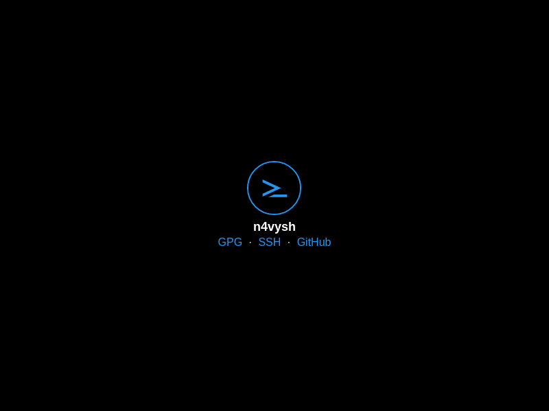

# portfolio

[](https://n4vysh.dev)

This repository contains the source code of the website to show my technical
skillsets and expertise.

## Requirements

- [Bash][bash-link]
- [Grep][grep-link]
- [sed][sed-link]
- [Gawk][gawk-link]
- [Findutils][findutils-link]
- [asdf][asdf-link]
- [Docker][docker-link]

optional

- [CCZE][ccze-link]
- [GoAccess][goaccess-link]

## Development Setup

Preview and edit the website on local machine as follows:

1. [Clone this repository on local machine][gh-clone-link]
1. Go to the project root directory of this repository in terminal
1. Run [`./scripts/install-packages.bash`][script-link] to install packages via
   asdf
1. Run `just` to start the server of [Aleph.js][alephjs-link] in `development`
   mode
1. Open <http://localhost:8080/> in browser
1. After done with the preview, press Ctrl-C in terminal to stop the server

While the preview is running, edit tsx and css files and will automatically
rebuild them.

## Test

Run `just check` to lint and format the source code with
[pre-commit][pre-commit-link].

## Containerize

Run `just build` to build docker image of [nginx][nginx-link] with
[Cloud Native Buildpacks][cnb-link]

## Update

Run `just update` to update dependency packages and pre-commit hooks.

## List

Run `just list` to list available commands in command runner.

## Deploy

Run following commands to deploy [Kubernetes][kubernetes-link] cluster and helm
charts.

```bash
just deploy            # development environment
ENV=stg    just deploy # staging environment
ENV=prd    just deploy # production environment
```

The development environment create local Kubernetes cluster with
[kind][kind-link]. Other environments create [K3s][k3s-link] cluster in
[Civo Cloud][civo-cloud-link] with [Terragrunt][terragrunt-link]. helm charts
deploy with [helmfile][helmfile-link].

Run following commands to show nginx highlighted access logs with ccze.

```bash
just log         # development environment
ENV=stg just log # staging environment
ENV=prd just log # production environment
```

Run following commands to analyze nginx access logs with GoAccess.

```bash
just analyze         # development environment
ENV=stg just analyze # staging environment
ENV=prd just analyze # production environment
```

Run following commands to change kubernetes context with [Kubie][kubie-link] and
debug kubernetes resources.

```bash
just switch         # development environment
ENV=stg just switch # staging environment
ENV=prd just switch # production environment
```

## License

This icon ([svg file](./misc/icon.svg)) distributed under the CC BY-NC-ND 4.0.
Other files distributed under the MIT license. See the
[LICENSE.txt](./LICENSE.txt) file for details.

[bash-link]: https://www.gnu.org/software/bash/
[grep-link]: https://www.gnu.org/software/grep/
[sed-link]: https://www.gnu.org/software/sed/
[gawk-link]: https://www.gnu.org/software/gawk/
[findutils-link]: https://www.gnu.org/software/findutils/
[asdf-link]: https://asdf-vm.com/
[docker-link]: https://www.docker.com/
[ccze-link]: http://freshmeat.net/projects/ccze/
[goaccess-link]: https://goaccess.io/
[gh-clone-link]: https://docs.github.com/en/get-started/getting-started-with-git/about-remote-repositories
[script-link]: ./scripts/install-packages.bash
[alephjs-link]: https://alephjs.org/
[nginx-link]: https://nginx.org/en/
[pre-commit-link]: https://pre-commit.com/
[cnb-link]: https://buildpacks.io/
[kubernetes-link]: https://kubernetes.io/
[kind-link]: https://kind.sigs.k8s.io
[k3s-link]: https://k3s.io/
[civo-cloud-link]: https://www.civo.com/
[terragrunt-link]: https://terragrunt.gruntwork.io/
[helmfile-link]: https://github.com/roboll/helmfile
[kubie-link]: https://github.com/sbstp/kubie
